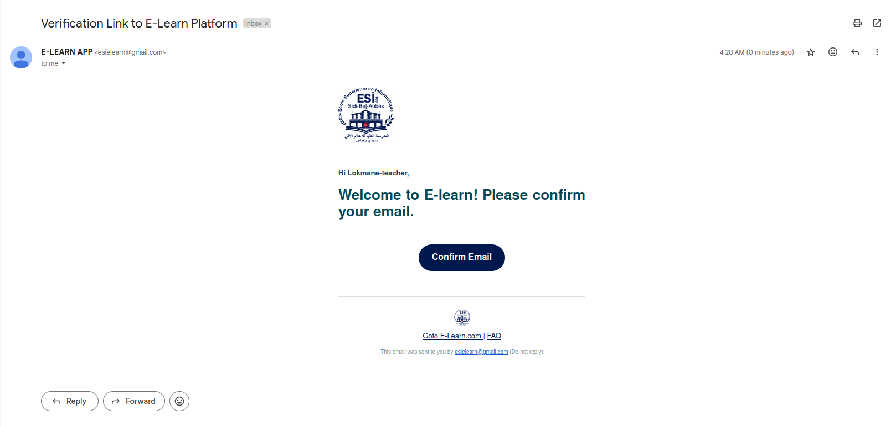

# Verify User Via Link To Email


**URL** : `/api/v1/auth/:userId/verify/:token`

**Method** : `GET`


**Auth required** : NO


## Success Response

**Code** : `200 OK`

**Content example**

```json
{

      "message": "Your account verified",
      "userData": {
            "id": "25e4dd71-cfd4-4850-a584-07271f47cddc",
            "fullName": "lokmane-teacher",
            "password": "$2b$12$bBA2uFUMwAeiSZ5MxxnKzuUQ8PZwgtWS7lteBrdleYEQ2FTImd40y",
            "email": "zeddoun.lokmane@gmail.com",
            "adminCreator": "7938246e-b113-46f7-9727-910684304bec",
            "color": "purple",
            "isVerified": true
      },
      "role": "teacher"

}
```

## Error Response

**Condition** : If Link have Expired Or not Valid .

**Code** : `401 BAD REQUEST`

**Content** :

```json
{

      "status": "Error",
      "err": {
            "statusCode": 500,
            "status": "Error",
            "isOperational": true
      },
      "message": "Invalid Link",
      "stack": "Error: Invalid Link\n    at /home/lokmane-zed/Desktop/E-Learn/E-Learn-Platform/back-end/controllers/authController.js:131:15\n    at process.processTicksAndRejections (node:internal/process/task_queues:95:5)"

}
```